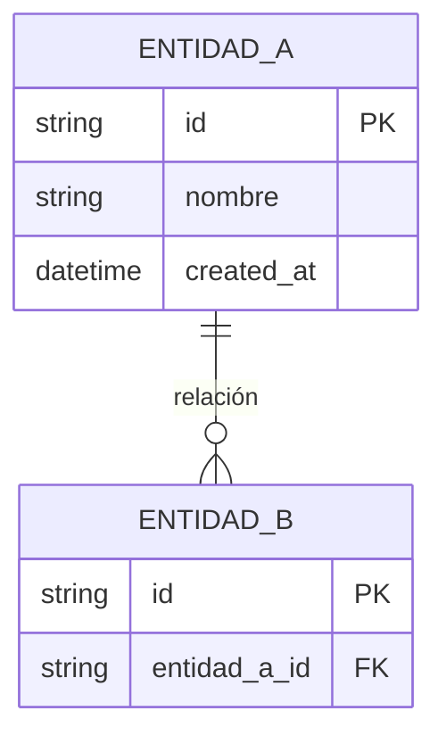
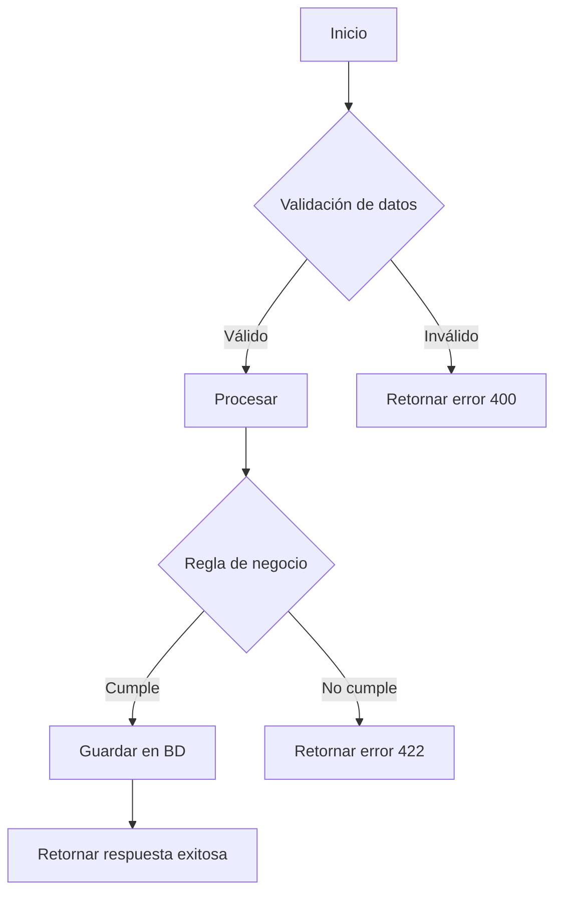
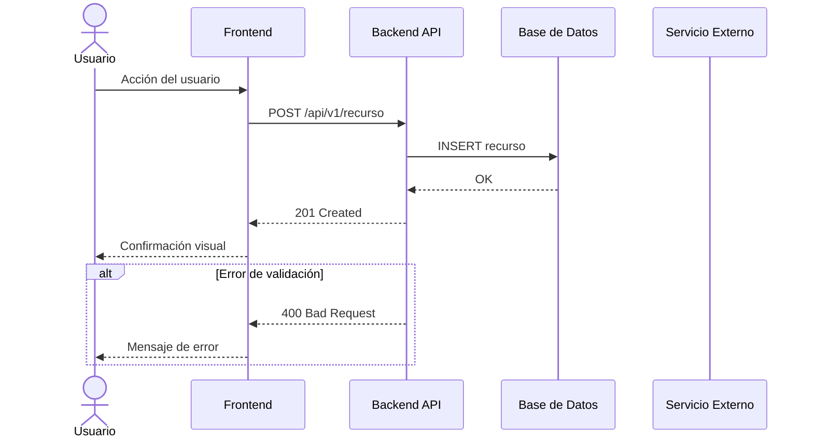

# Spec: [Título de la Historia de Usuario]

> **Estado:** `BORRADOR` → El equipo técnico revisa y aprueba antes de implementar.  
> **Ciclo de vida:** BORRADOR → EN_REVISION → APROBADO → EN_IMPLEMENTACION → COMPLETADO

---

## 1. Contexto y Propósito

[Por qué existe esta funcionalidad, qué problema de negocio resuelve, quién se beneficia y cómo se relaciona con el producto general]

---

## 2. Alcance

### Incluido
- [Qué contempla esta spec — ser específico]
- [Cada punto debe ser verificable]

### Excluido
- [Qué NO contempla — prevenir scope creep]
- [Funcionalidades que se harán en otro sprint/spec]

---

## 3. Criterios de Aceptación (Gherkin)

> Refinados por `gherkin-writer`, ajustados a nivel técnico por `spec-writer`.

### Escenario 1: [Happy Path]
```gherkin
Feature: [Nombre de la funcionalidad]
  Scenario: [Descripción del flujo exitoso]
    Given [precondición]
    When  [acción principal]
    Then  [resultado verificable]
```

### Escenario 2: [Error Path]
```gherkin
Feature: [Nombre de la funcionalidad]
  Scenario: [Descripción del flujo de error]
    Given [precondición]
    When  [acción inválida]
    Then  [manejo de error con mensaje y código HTTP si aplica]
```

### Escenario 3: [Edge Case]
```gherkin
Feature: [Nombre de la funcionalidad]
  Scenario: [Descripción del caso borde]
    Given [precondición de borde]
    When  [acción en el límite]
    Then  [resultado esperado]
```

---

## 4. Modelo de Datos

### Entidades afectadas

| Entidad | Almacén | Estado | Descripción |
|---------|---------|--------|-------------|
| `[Entidad]` | [tabla/colección] | Nueva / Modificada | [descripción] |

### Campos del modelo

| Campo | Tipo | Obligatorio | Validación | Descripción |
|-------|------|-------------|------------|-------------|
| `id` | string (UUID) | Sí | auto-generado | Identificador único |
| `created_at` | datetime (UTC) | Sí | auto-generado | Timestamp creación |
| `updated_at` | datetime (UTC) | Sí | auto-generado | Timestamp actualización |

### Diagrama ER (Mermaid)



---

## 5. Contrato de API / Interfaces

> Solo si la HU implica endpoints o integración con sistemas.

### POST /api/v1/[recurso]
- **Descripción:** [qué hace]
- **Auth:** Bearer token requerido
- **Request Body:**
  ```json
  { "campo": "tipo (requerido|opcional)" }
  ```
- **Response 201:**
  ```json
  { "id": "uuid", "campo": "valor", "created_at": "ISO-8601" }
  ```
- **Response 400:** Campo obligatorio faltante
- **Response 401:** Token ausente o expirado
- **Response 409:** Conflicto de unicidad

---

## 6. Lógica de Negocio

### Reglas de negocio
1. [Regla de validación]
2. [Regla de autorización]
3. [Regla de integridad]
4. [Regla de cálculo/derivación]

### Flujo de decisión



---

## 7. Diagrama de Secuencia (SSD)



---

## 8. Lista de Tareas de Implementación

> Checklist accionable por capa. El `task-estimator` proporciona la base.

### Backend
- [ ] [T-XX-01] Crear/actualizar modelos de datos
- [ ] [T-XX-02] Implementar repositorio (CRUD)
- [ ] [T-XX-03] Implementar servicio (lógica de negocio)
- [ ] [T-XX-04] Implementar endpoint(s) HTTP
- [ ] [T-XX-05] Registrar en el punto de entrada de la app

### Frontend
- [ ] [T-XX-06] Crear componentes UI
- [ ] [T-XX-07] Implementar hooks/store de estado
- [ ] [T-XX-08] Implementar servicios de comunicación con API
- [ ] [T-XX-09] Registrar ruta en el router

### QA / Testing
- [ ] [T-XX-10] Tests unitarios del servicio (cobertura ≥ 80%)
- [ ] [T-XX-11] Tests de integración del endpoint
- [ ] [T-XX-12] Tests del componente frontend
- [ ] [T-XX-13] Escenarios Gherkin automatizados

### DevOps / Infraestructura
- [ ] [T-XX-14] Variables de entorno configuradas
- [ ] [T-XX-15] Pipeline de CI/CD actualizado (si aplica)

---

## 9. Criterios de Validación

> Cómo se prueba que la spec fue implementada correctamente.

- [ ] Todos los escenarios Gherkin pasan como tests automatizados
- [ ] Las APIs responden según el contrato definido
- [ ] Los datos se persisten correctamente en la BD
- [ ] La UI renderiza correctamente en resoluciones 768px+
- [ ] Los errores se manejan graciosamente (sin crashes)
- [ ] La performance cumple los SLA definidos (si aplica)

---

## 10. Definition of Done

- [ ] Código revisado y aprobado en Pull Request
- [ ] Tests unitarios con cobertura ≥ 80% en lógica de negocio
- [ ] Tests de integración pasando
- [ ] Escenarios Gherkin automatizados
- [ ] Documentación técnica actualizada
- [ ] Demo aprobada por el Product Owner / PM
- [ ] Desplegado en entorno de QA

---

## Historial de Iteraciones

| Versión | Fecha | Cambios | Autor |
|---------|-------|---------|-------|
| v1.0 | YYYY-MM-DD | Borrador inicial | spec-writer |

---

*Generado por: Requirement Refinator V1 — Sofka BU1*  
*Agente: spec-writer v1.0*  
*Metodología: SDD (Spec-Driven Development)*
